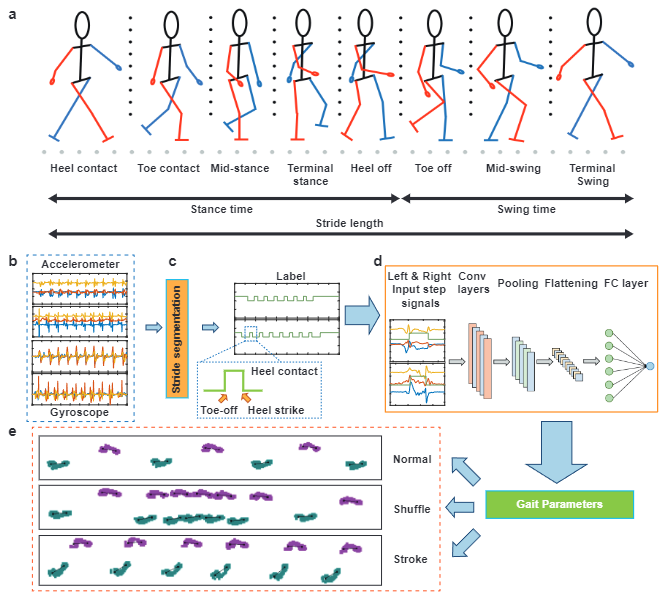
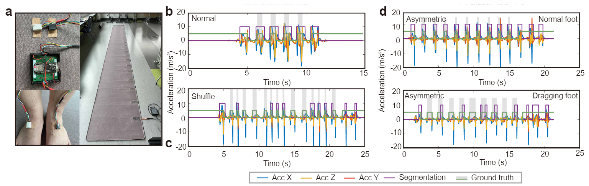

# Project Name

GaitMotion: A Multitask Dataset for Pathological Gait Forecasting. Please access our dataset at the [UBC dataverse.](https://doi.org/10.5683/SP3/V6C59O)



## Table of Contents

- [Introduction](#introduction)
- [Features](#features)
- [Implementation](#implementation)
- [Citation](#citation)
- [Contributing](#contributing)
<!-- - [License](#license) -->

## Introduction

We provide a dataset for the gait analysis which contains extensive ground truths from gait events at the sample index level to gait parameters for normal and pathological walking patterns. We also provide a baseline model to predict the gait parameters from IMU recordings. 

## Features

GaitMotion dataset presents a comprehensive dataset on gait and an baseline model for analyzing it. Gait variablity are closely related to specific parameters in the gait cycle, containing a combination of stance and swing phases. Our dataset includes parameters on three different tasks: normal, Stroke and Parkinson's gaits. The gait cycle consists of multiple critical states that support walking. Any failure in gait events can lead to the risk of falling. GaitMotion has rich ground truth labels which could support stride-to-stride fluctuation analysis in different types of walking. 



## Implementation

To run the training:

```
python train.py --type Normal Shuffle Stroke --seq_length 800 --seq_buffer 600 --subID 6 
python train.py --type Normal Shuffle Stroke --seq_length 1000 --seq_buffer 800 --subID 5 
```

Change the parameter accordingly. The seq_length parameter controls the step segmentation length. The subID is the participant ID that you hope to test with. The model will train the remaining subjects and test the subID participant. 

<!-- To run the transfer learning model which evalidate on the eGait dataset, please download the csv files from [google drive](https://drive.google.com/drive/folders/1Wtr-yn89HD1tjn-iImxRkAAldIZTGJcY?usp=sharing). -->
To run the transfer learning model which evalidate on the eGait dataset:
```
python transfer_eval.py
```

## Citation

If you find the dataset or code useful, please cite our papers:

{}

## Contributing

We express our gratitude to the volunteers who participated in the data collection experiment. Thanks for Prof. Calvin Kuo's guidance on the data collection and arrangement. 

<!-- ## License
This project is licensed under the [MIT License](LICENSE). -->
